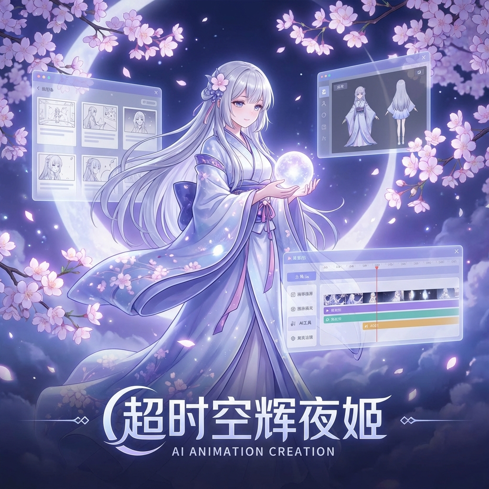
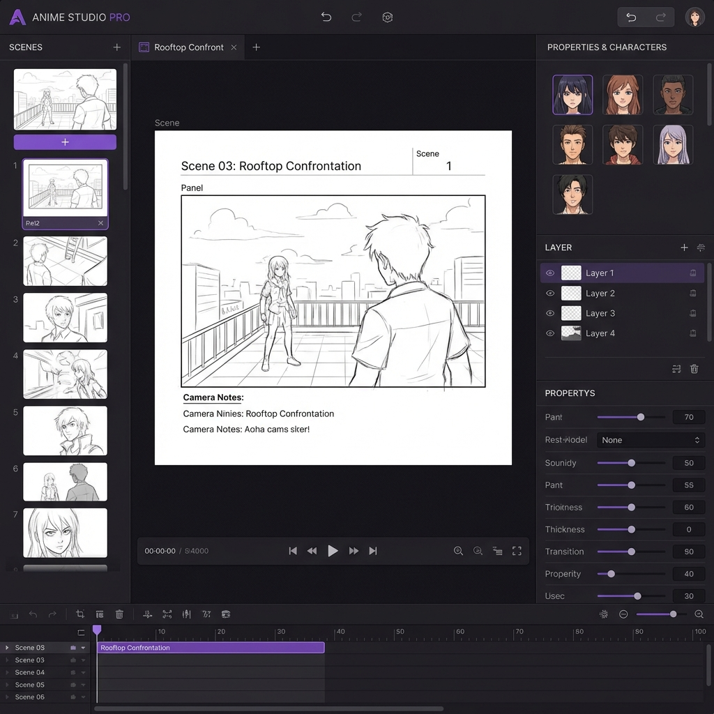

<div align="center">

# 🌙 超时空辉夜姬

### AI 动画创作平台 | AI Animation Creation Platform

**让每个人都能创作属于自己的动画故事**

[](./CHANGELOG.md)
[]()
[]()

[🎬 产品演示](#产品演示) · [✨ 核心功能](#核心功能) · [🚀 快速开始](#快速开始) · [📖 使用指南](#使用指南)

---



</div>

---

## 🎯 产品简介

**超时空辉夜姬** 是一款革命性的 AI 动画创作平台，灵感源自 Netflix 动画电影《超时空辉夜姬！》。

我们相信，动画创作不应该只属于专业人士。通过先进的人工智能技术，让每个有创意的人都能将脑海中的故事变成精美的动画作品。

### 🎬 适合人群

| 用户类型 | 使用场景 |
|---------|---------|
| 🎨 **创意爱好者** | 将脑海中的故事快速可视化 |
| 📚 **内容创作者** | 制作短视频、自媒体动画内容 |
| 🎓 **教育工作者** | 创建生动的教学动画素材 |
| 🏢 **企业用户** | 制作产品演示、品牌动画 |

---

## ✨ 核心功能

### 🎨 AI 角色设计

只需描述你心中的角色，AI 就能为你生成精美的动画角色设计稿。

> "一位穿着和服的神秘少女，银色长发，月光般的眼睛"

**→ AI 自动生成完整角色立绘、表情包、多角度视图**

---

### 🖼️ 智能场景构建

将文字描述转化为精美的动画场景背景。

支持多种风格：
- 🌸 日式动画风格
- 🎮 赛博朋克风格  
- 🏯 中国风水墨
- 🌌 科幻未来风格

---

### 📝 AI 剧本生成

提供故事大纲，AI 帮你完成：
- ✍️ 对话编写
- 🎭 情感渲染
- 🎬 分镜脚本

---

### 🎬 可视化分镜编辑器



- 📋 直观的拖拽式分镜管理
- 🔄 实时预览效果
- 💾 自动保存，云端同步

---

## 🚀 快速开始

### 三步开始创作

```
1️⃣  创建项目 → 输入你的故事名称
2️⃣  设计角色 → 描述你的主角，一键生成
3️⃣  添加场景 → 构建你的故事世界
```

### 系统要求

| 类型 | 要求 |
|------|------|
| 浏览器 | Chrome 90+, Safari 15+, Firefox 88+ |
| 网络 | 稳定的互联网连接 |
| 设备 | 桌面端 / 平板（推荐 1280×720 以上分辨率）|

---

## 📖 使用指南

详细使用教程请参阅：

- [新手入门指南](./getting-started/quickstart.md)
- [角色设计技巧](./features/character-design.md)
- [场景构建教程](./features/scene-building.md)
- [分镜编辑器使用](./features/storyboard-editor.md)

---

## 🗺️ 产品路线图

### ✅ v0.1.0 (当前版本)
- [x] 项目管理系统
- [x] 角色设计与管理
- [x] 场景编辑器
- [x] 分镜编辑器

### 🚧 v0.2.0 (即将推出)
- [ ] AI 文生图集成
- [ ] AI 图生视频
- [ ] 视频导出功能

### 🔮 未来计划
- [ ] AI 配音合成
- [ ] AI 背景音乐
- [ ] 多人协作
- [ ] 移动端 App

---

## 💬 联系我们

- 📧 **邮箱**: caspianchan3@gmail.com
- 🐦 **Twitter**: 🚧 装修中
- 💬 **Discord**: 🚧 装修中

---

## 📄 许可协议

Copyright © 2026 SecondAni Team. All Rights Reserved.

---

<div align="center">

**Inspired by 《超时空辉夜姬！》**

⭐ 如果您喜欢这个产品，欢迎 Star 支持！

</div>
